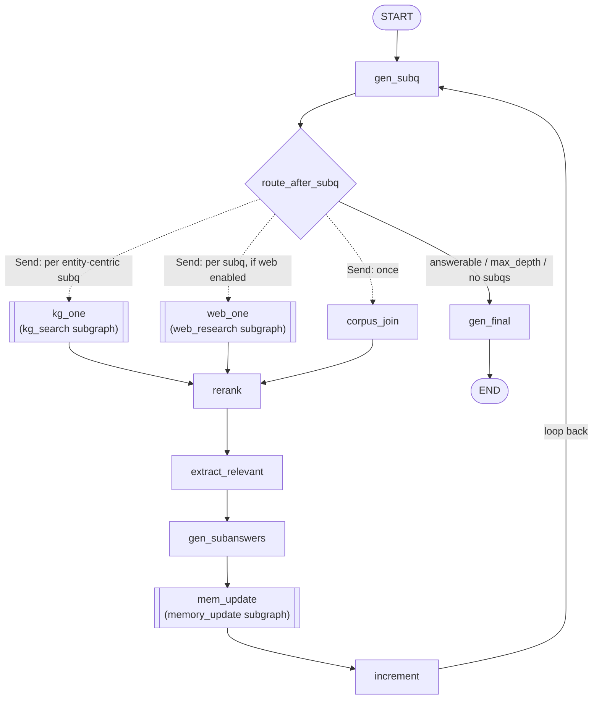
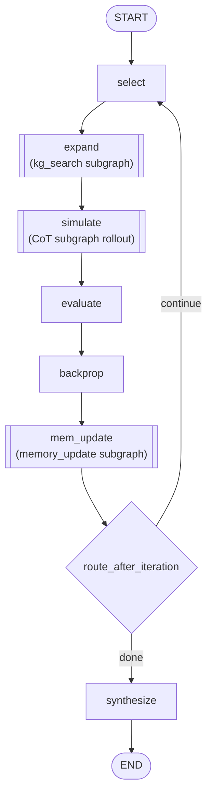

# langgraph_coe — System Design

This document describes how `langgraph_coe` is built on
[LangGraph](https://docs.langchain.com/oss/python/langgraph/thinking-in-langgraph).
It assumes familiarity with the package overview in
[`../langgraph_coe/README.md`](../langgraph_coe/README.md); here we focus on *why*
the reasoning system is expressed as graphs and how the pieces fit together.

---

## 1. Thinking in LangGraph

LangGraph's core idea is to model an application as a **graph** rather than a
linear chain:

- **State** — a single typed object (here, `TypedDict`s) that every step reads
  and writes. Each field is a *channel*; a channel may declare a **reducer** that
  decides how multiple writes to it are combined.
- **Nodes** — plain (async) functions `state -> partial_state`. A node returns
  only the keys it changed; LangGraph merges that partial via the channels'
  reducers.
- **Edges** — control flow. Static edges (`A -> B`), **conditional edges** (a
  router function picks the next node), and the **`Send` API** (dynamic
  map-reduce fan-out to N parallel workers).
- **Supersteps** — execution is Pregel/BSP: all nodes scheduled in a superstep
  run (potentially in parallel), their writes are reduced into state, then the
  next superstep is scheduled. A `recursion_limit` caps the number of
  supersteps, which is how loops terminate safely.
- **Subgraphs** — a compiled graph can be invoked from inside a node, so complex
  steps compose like function calls.

This maps cleanly onto COE's two reasoning strategies:

| Reasoning need | LangGraph feature |
|----------------|-------------------|
| Iterative decompose→retrieve→answer loop (CoT) | conditional edge looping back to an earlier node |
| Decompose one question into N parallel sub-retrievals | `Send` fan-out + reduce |
| Tree search with select/expand/simulate/backprop (MCTS) | a node per phase + a loop edge, tree stored in a reduced channel |
| Shared, evolving text+graph memory | state channels carried across iterations |
| Reusable retrieval / memory routines | subgraphs invoked inside nodes |

The result: the search algorithm *is* the graph topology, and the data flow
(evidence, memory, tree) *is* the state — both inspectable in LangGraph traces.

---

## 2. State as the system's memory

Two top-level state schemas live in `graphs/cot.py` (`CoTState`) and
`graphs/mcts.py` (`MCTSState`). The interesting part is the **reducers**, because
they encode how looping and parallel writes are reconciled.

### Reducers used

| Reducer | Defined in | Semantics | Used for |
|---------|-----------|-----------|----------|
| `append_or_clear` (+ `Clear` sentinel) | `cot.py` | append lists across writes; reset to `[]` when a node emits `Clear()` | per-iteration retrieval scratch (`retrieved_raw_context`, `retrieved_raw_triples`, `new_raw_triples`, `new_retrieval_texts`) |
| `operator.add` | stdlib | concatenate | append-only `iteration_history` trajectory |
| `dict_merge` | `mcts.py` | rightward dict union, right wins on key collision | the MCTS `tree` (`{node_id: node}`) — covers both new-node injection and in-place visit/value updates |
| *(default overwrite)* | LangGraph | last write wins | scalars, the shared memory objects, outputs |

The `Clear` sentinel is a small but important design choice: per-iteration
scratch must accumulate across the parallel retrieval workers **within** an
iteration but reset **between** iterations. A typed sentinel (rather than a magic
string) makes the reducer signature unambiguous — a list of evidence strings can
never collide with the reset marker.

### Shared cross-iteration memory

Both schemas carry the COE research contribution — coordinated **text + graph
memory** — as plain channels that survive every loop:

- `text_memory: List[str]` — evidence snippets, intermediate facts, hypotheses.
- `graph_memory: nx.DiGraph` — entity/relation structure for multi-hop
  consistency.
- `entity_dict: Dict[str, Any]` — linked Wikidata entities (QIDs), reused to
  short-circuit re-linking and to drive the adaptive KG gate.

These are *not* reduced (last-write-wins) because they are updated atomically by
the memory-update subgraph (§5), which reads the current memory and returns the
next version.

---

## 3. The CoT strategy graph (`graphs/cot.py`)

Chain-of-thought is the decompose→retrieve→answer loop, made explicit.

> Dotted edges are `Send` fan-out (the **map** step); the static edges into
> `rerank` are the **reduce** step. A `[[double-boxed]]` node invokes a subgraph.

Nodes (all registered with `builder.add_node`):

| Node | Role | Notes |
|------|------|-------|
| `gen_subq` | decompose the question into sub-questions | runs `SUBQUESTION_GENERATOR` with `n` completions, pools them (`pool_subquestions`); also decides `is_answerable` and per-subq `needs_kg` |
| `kg_one` | per-subquestion KG retrieval | invokes the **kg_search subgraph** |
| `web_one` | per-subquestion web retrieval | invokes the **web_research subgraph** (only if `web_search.enabled`) |
| `corpus_join` | corpus FAISS retrieval for all subqs | embedding-only recall floor |
| `rerank` | rerank merged candidate pool | SGLang reranker; skipped when pool ≤ top_k |
| `extract_relevant` | distill passages → atomic facts | `EXTRACTOR`, batched on char budget |
| `gen_subanswers` | answer each subq from facts | `ANSWER_GENERATOR` |
| `mem_update` | fold subanswers/triples into memory | invokes the **memory_update subgraph** |
| `increment` | record trajectory, clear scratch | emits `Clear()` for per-iteration channels, `depth += 1` |
| `gen_final` | synthesize the final answer | `FINAL_ANSWER_SYNTHESIZER` |

### Branching and fan-out

`route_after_subq` is the conditional edge after `gen_subq`. It returns either:

- `"gen_final"` — when the question is answerable, `depth >= max_depth`, or no
  new sub-questions were produced (graceful termination), **or**
- a `List[Send]` — one `Send("kg_one", {…, subquery})` per entity-centric
  sub-question, optional `Send("web_one", …)`, plus a single
  `Send("corpus_join", …)`.

This is the **map** step: each `Send` injects a per-worker `subquery` into a copy
of state and runs the workers in parallel within one superstep. They all have a
static edge to `rerank`, which is the **reduce** step — it sees the accumulated
`retrieved_raw_context`/`retrieved_raw_triples` (merged by `append_or_clear`).

### The loop

`increment -> gen_subq` is the back-edge that makes CoT iterative. Termination is
guaranteed three ways: the `max_depth` check in the router, the `is_answerable`
short-circuit, and LangGraph's `recursion_limit` (`search.cot.recursion_limit`)
as a hard superstep ceiling.

### Adaptive retrieval gate

Rather than always firing every retriever, the router keeps cost down: corpus
always fans out (cheap, embedding-only), KG fires only when the generator tagged
a sub-question entity-centric (`needs_kg`) **or** the sub-question mentions an
entity already in `entity_dict` (a resolved QID is the highest-yield KG case),
and web fires only when explicitly enabled.

---

## 4. The MCTS strategy graph (`graphs/mcts.py`)

MCTS is a search loop; each phase is a node and the tree lives in a reduced
channel.

> A `[[double-boxed]]` node invokes a subgraph; the `select` back-edge is the
> MCTS iteration loop.

| Node | Role |
|------|------|
| `select` | pUCT traversal root→leaf (seeds the root if the tree is empty) |
| `expand` | dispatch on leaf `node_type` → generate child nodes (parallel generators), gather evidence |
| `simulate` | CoT rollout from an expanded child via the **CoT subgraph**, sharing memory |
| `evaluate` | score the rollout (`VERIFIER`) under no-context / text-memory / graph-memory views — its rating is the reward |
| `backprop` | increment visits and add reward along `current_path`; fold per-iteration semantic signals |
| `mem_update` | fold new triples/retrieval facts into memory via the **memory_update subgraph** |
| `synthesize` | emit the final answer from the best path |

### Tree as a reduced channel

The search tree is `tree: Annotated[Dict[str, MCTSTreeNode], dict_merge]`. Nodes
emit *partial* tree dicts — `expand`/`simulate` inject new nodes; `backprop`
re-emits only the touched nodes with updated `visits`/`value`. `dict_merge`
(rightward union) folds each partial into the whole, so no node ever has to read,
copy, and rewrite the entire tree. Node priors per type live in
`NODE_TYPE_PRIOR`.

### The loop and early stopping

`route_after_iteration` (conditional edge after `mem_update`) returns `"select"`
to run another iteration or `"synthesize"` to finish. Beyond the `num_iterations`
hard cap and the `recursion_limit` superstep ceiling, it supports early
termination on high-confidence reward, accumulated semantic-sufficiency signals,
and convergence patience — but never before `min_iterations`.

---

## 5. Subgraphs: composition by invocation

`langgraph_coe` keeps three reusable routines as **compiled subgraphs**, built
once in the parent's `build_*` closure and invoked with `.ainvoke()` from inside
nodes (the "subgraph as a function" pattern, rather than embedding them as graph
nodes). MCTS additionally invokes the entire **CoT graph** as its rollout engine.

| Subgraph | File | Flow | Invoked by |
|----------|------|------|-----------|
| KG search | `graphs/kg_search.py` | `ner_agent → triple_search_agent → enrich` | CoT `kg_one`, MCTS `expand` |
| Web research | `graphs/web_research.py` | ReAct search/crawl loop with loop-prevention | CoT `web_one` |
| Memory update | `graphs/memory_update.py` | `consolidate_pre → open_ie → link_entities → merge_and_prune → textualize_graph → (consolidate_post?) → finalize_memory` | CoT/MCTS `mem_update` |
| CoT (as rollout) | `graphs/cot.py` | the full CoT graph | MCTS `simulate` |

The **kg_search** subgraph itself mixes one-shot structured output (the NER node
is `with_structured_output(NEROutput)` + a direct `link_entities` tool call) with
a true tool-calling **agent** (`langchain.agents.create_agent`, built on
LangGraph) for the iterative triple search. The **memory-update** subgraph is
where the text↔graph coordination happens: a single OpenIE extraction pass,
batched `triple_pruner` on *newly proposed* edges only, and an optional
consolidation pass that folds newly-textualized graph triples back into prose
memory.

---

## 6. LLM roles and tiering (`roles.py`, `llm.py`)

Nodes never call an LLM directly. Instead:

1. Each unit of LLM work is a `Role` (`roles.py`): a name + system prompt +
   Pydantic **input** model + Pydantic **output** model.
2. `RoleModelRegistry` (`llm.py`) maps a role name → a **tier** (`heavy` /
   `medium` / `light` / `classify` via `config.role_tiers`) → a configured
   `ChatLiteLLM` model, and exposes `get_model(role)` and the role-execution
   helper `execute_role_lc(...)`.
3. `execute_role_lc` runs `model.with_structured_output(output_model,
   include_raw=True)`, parses the result, and on a structured-output failure
   retries with perturbed sampling ("shaking") before falling back to a safe
   default — so a single bad generation never breaks the graph loop.

Tiering lets the expensive reasoning roles (answer synthesis, decomposition,
self-correction) run with large thinking budgets while bounded fixed-shape
outputs (triple pruning, NER, rephrasing) use a cheap `classify` tier. Because
roles share prompt **context** prefixes across batched calls, SGLang's
RadixAttention serves most of each batch from the prefix cache.

---

## 7. Execution model and lifecycle

`system.py:answer(question)` is the single public entry point:

1. **Runtime init** (`_init_runtime`, idempotent at module scope): wires the
   Wikidata client, web search, FAISS retrieval pipeline, and — if
   `cache.enabled` — the Redis caches (LangChain LLM cache + a `RedisDictCache`
   for Wikidata/web).
2. **Per-question reset**: clears the `ContextVar` sessions (visited-URL /
   Wikidata session) exactly once at entry, not per subgraph call.
3. **Build the selected graph**: only the configured strategy
   (`search.strategy`) is built — `build_mcts_graph` or `build_cot_graph` — with
   a fully-seeded initial state (`_initial_mcts_state` / `_initial_cot_state`).
4. **Invoke**: `await graph.ainvoke(initial_state, {"recursion_limit": …})`.
5. **Adapt**: the final state dict is lifted into the strategy-agnostic
   `AnswerResult` envelope (`answer`, `concise_answer`, `reasoning`, plus
   bookkeeping in `metadata`).

`answer_batch` runs many `answer` calls concurrently under a semaphore,
preserving input order. Everything is async end-to-end; nodes that fan out (CoT
`Send` workers, MCTS parallel generators) exploit the superstep model to run
concurrently, and `recursion_limit` bounds total work regardless of strategy.

---

## 8. Why graphs (design rationale)

- **The algorithm is visible.** MCTS phases and the CoT loop are nodes and edges,
  not control flow buried in a `while` loop — every step, branch, and state
  mutation shows up in a LangGraph trace.
- **Parallelism is declarative.** `Send` fan-out + reducers express map-reduce
  retrieval without manual `asyncio.gather` bookkeeping in the strategy code.
- **Composability.** Memory update, KG search, web research, and even the CoT
  rollout are independent compiled graphs, testable in isolation and reused
  across strategies.
- **Safe termination.** Loops can never run away: routers enforce
  domain limits and `recursion_limit` is a hard superstep ceiling.
- **Memory is first-class.** Coordinated text + graph memory lives in state
  channels carried across every iteration, which is exactly the research
  contribution COE is built to study.

---

## See also

- [`../langgraph_coe/README.md`](../langgraph_coe/README.md) — package overview, API, configuration
- [`../langgraph_coe/evaluation/README.md`](../langgraph_coe/evaluation/README.md) — evaluation CLI and artifacts
- [`setup_generation_params.md`](setup_generation_params.md) / [`setup_thinking_budget.md`](setup_thinking_budget.md) — LLM tier knobs
- [LangGraph: Thinking in LangGraph](https://docs.langchain.com/oss/python/langgraph/thinking-in-langgraph)
