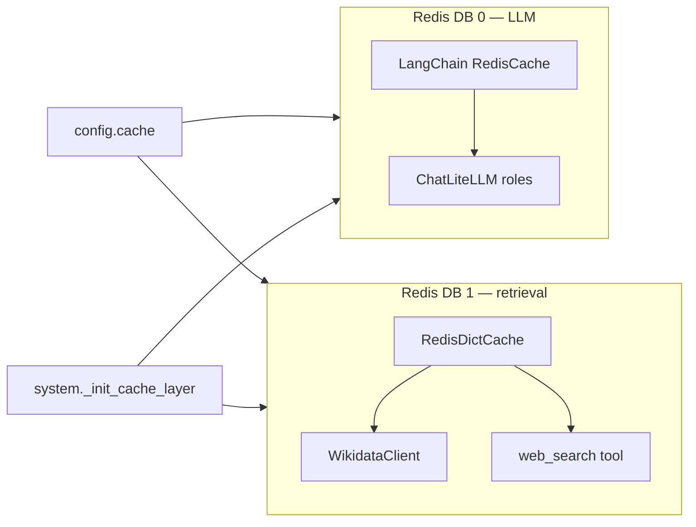

# Setting Up Redis Cache for `langgraph_coe`

This guide covers installing Redis and enabling persistent caching for **LLM
responses**, **Wikidata lookups**, and **web search** in the LangGraph CoE stack.
Wiring is in `langgraph_coe/system.py` (`_init_cache_layer` → `_init_runtime`)
and `langgraph_coe/config.yaml` under `cache`.

> **TL;DR**
> 1. Start Redis on `localhost:6379` (or set `cache.redis.host` / `port`).
> 2. Set `cache.enabled: true` in `langgraph_coe/config.yaml`.
> 3. Use `system.answer()` (or mirror `_init_cache_layer` in custom scripts).
> 4. DB **0** = LangChain LLM cache; DB **1** = Wikidata + `web_search` (`wd:*`, `web:*` keys).

---

## Prerequisites

- Python env with `redis` installed (`uv` project venv or conda `wemg`).
- `redis-server` binary (bundled in conda `wemg`, or system package).
- For web cache hits during eval: `SERPER_API_KEY` in `.env` or `web_search.api_key` (optional; DuckDuckGo fallback if unset).

Redis **password auth** is not configured in `CacheRedisConfig` today — use host/port on a trusted network or extend `langgraph_coe/config.py` if you need it.

---

## 1. Install and start Redis

### Local dev (conda `wemg`)

```bash
conda activate wemg
mkdir -p /tmp/redis-wemg-test
redis-server --daemonize yes --port 6379 --dir /tmp/redis-wemg-test --save ""
redis-cli -p 6379 ping   # expect PONG
```

### Shared / production host

Point `cache.redis.host` and `cache.redis.port` at your team's Redis instance instead of starting a local daemon.

### Stop / inspect

```bash
redis-cli -p 6379 shutdown
redis-cli -n 1 DBSIZE          # keys on Wikidata + web db
redis-cli -n 1 KEYS 'wd:*' | head
redis-cli -n 1 KEYS 'web:*' | head
```

---

## 2. Enable cache in config

Edit `langgraph_coe/config.yaml`:

```yaml
cache:
  enabled: true
  redis:
    host: localhost
    port: 6379
    llm_db: 0          # LangChain LLM response cache
    wikidata_db: 1     # Wikidata + web_search (shared JSON cache)
  wikidata:
    entity_ttl: 2592000   # 30 days — wd:entity:{qid}
    search_ttl: 604800    #  7 days — wd:search:{name}:{top_k}
    triples_ttl: 604800   #  7 days — wd:triples:{qid}
    enrich_ttl: 2592000   # 30 days — wd:enrich:{qid}
  web:
    ttl: 86400            # 24 hours — web:{query}:{top_k}
```

Other surfaces (corpus FAISS, embedder, reranker) use HTTP endpoints — see
[deploy_reranker_server.md](deploy_reranker_server.md) and
[deploy_local_wikidata-v2.md](deploy_local_wikidata-v2.md). They do **not** use this Redis layer.

---

## 3. Run with caching on

```python
from langgraph_coe.config import LangGraphCoeConfig
from langgraph_coe.system import answer

cfg = LangGraphCoeConfig.from_yaml()
# cfg.cache.enabled must be true in YAML (or cfg.cache.enabled = True)
result = await answer("What is the capital of France?", config=cfg)
```

`answer()` calls `_init_runtime`, which:

1. Builds `RedisDictCache` on Redis db `wikidata_db` and attaches it to `init_wikidata(..., cache=...)` and `tools.web._web_cache`.
2. Sets LangChain `RedisCache` on Redis db `llm_db` via `set_llm_cache`.

Per-question in-memory resets (`reset_wikidata_session`, `reset_web_research_session`) still run inside `answer()`. **Redis keys persist across questions** by design (eval workloads favor reuse over freshness).

---

## Architecture

One Redis **instance**, two logical **DB indices**:



| DB | Consumer | Mechanism | What is cached |
|----|----------|-----------|----------------|
| `cache.redis.llm_db` (default `0`) | All `RoleModelRegistry` LLM calls | LangChain `RedisCache` via `set_llm_cache` | Serialized LLM prompts/responses (LangChain keying) |
| `cache.redis.wikidata_db` (default `1`) | `WikidataClient` | `RedisDictCache` via `init_wikidata(..., cache=...)` | Entity, search, triples, Wikipedia enrich |
| Same db `1` | `web_search` | Same `RedisDictCache` on `tools.web._web_cache` | `web:{query}:{top_k}` → result list |

**Not cached on Redis**

- Wikidata **pruning** (`fetch_and_prune_subgraph`) — query-dependent, low reuse.
- **Corpus** FAISS / `corpus_search` — separate index + embedder URLs.

---

## Key namespaces (DB 1)

Implemented in `langgraph_coe/tools/cache.py` (`RedisDictCache`) and tool clients.

| Prefix | Key pattern | Default TTL | Set by |
|--------|-------------|-------------|--------|
| `wd:entity` | `wd:entity:{qid}` | 30d | `WikidataClient.get_entity` |
| `wd:search` | `wd:search:{name.lower()}:{top_k}` | 7d | `WikidataClient.search_entities` |
| `wd:triples` | `wd:triples:{qid}` | 7d | `WikidataClient.get_triples` |
| `wd:enrich` | `wd:enrich:{qid}` | 30d | `WikidataClient.get_wikipedia_content` |
| `web` | `web:{query.lower()}:{top_k}` | 24h | `web_search` in `langgraph_coe/tools/web.py` |

Values are JSON. Redis errors on get/set are **swallowed** (treated as cache miss).

### Invalidation

No automatic invalidation in code — long TTLs only. To force fresh data:

```bash
redis-cli -n 1 FLUSHDB    # destructive: all wd:* and web:* on db 1
```

Or delete by prefix:

```bash
redis-cli -n 1 --scan --pattern 'web:*' | xargs -r redis-cli -n 1 DEL
```

---

## Wiring by tool

### Wikidata

```python
from langgraph_coe.config import LangGraphCoeConfig
from langgraph_coe.tools.wikidata import init_wikidata

cfg = LangGraphCoeConfig.from_yaml()
# shared = RedisDictCache from system._init_cache_layer(cfg)
init_wikidata(cfg.wikidata, cache=shared)
```

The client keeps **in-process LRU** (L1); Redis is L2 across runs. Wikidata tool detail: [setup_wikidata_tools.md](setup_wikidata_tools.md).

### Web search

`init_web_search(cfg.web_search)` configures Serper or DuckDuckGo. The cache handle is set in `_init_cache_layer`:

```python
from langgraph_coe.tools.web import init_web_search, web_search

init_web_search(cfg.web_search)
# tools.web._web_cache must be set when cache.enabled
results = await web_search.ainvoke({"query": "capital of France"})
```

Cache hits skip the search API. URL dedup within one question uses a **ContextVar** (`reset_web_research_session`), separate from Redis.

Requires `web_search.enabled: true` in config for CoT/MCTS web fan-out (off by default for paper parity).

### LLM roles

When `cache.enabled: true`, all `registry.get_model(...)` calls share the global LangChain `RedisCache` on db `0`. There is no per-role toggle.

### Corpus retrieval

`init_retrieval_pipeline` / `corpus_search` do **not** use Redis. Configure `retriever.corpus` and `reranker` in `langgraph_coe/config.yaml`.

---

## Manual setup (scripts and tests)

Without `system.answer()`, mirror `langgraph_coe/system.py`:

```python
import redis
from langgraph_coe.config import LangGraphCoeConfig
from langgraph_coe.tools.cache import RedisDictCache
from langgraph_coe.tools.wikidata import init_wikidata
from langgraph_coe.tools.web import init_web_search
from langgraph_coe.tools import web as web_tools

cfg = LangGraphCoeConfig.from_yaml()
rc = cfg.cache.redis
client = redis.Redis(host=rc.host, port=rc.port, db=rc.wikidata_db, decode_responses=False)
shared = RedisDictCache(
    client=client,
    ttls={
        "entity": cfg.cache.wikidata.entity_ttl,
        "search": cfg.cache.wikidata.search_ttl,
        "triples": cfg.cache.wikidata.triples_ttl,
        "enrich": cfg.cache.wikidata.enrich_ttl,
        "web": cfg.cache.web.ttl,
    },
)
web_tools._web_cache = shared
init_wikidata(cfg.wikidata, cache=shared)
init_web_search(cfg.web_search)
```

For LLM cache alone, use db `0` and `set_llm_cache(RedisCache(...))` as in `system.py`.

---

## Verification tests

From repo root with **uv** and Redis listening on `cache.redis.host:port`:

```bash
# Fakeredis unit tests (no running server)
uv run pytest langgraph_coe/tests/phase0/test_redis_cache_web.py -v
uv run pytest langgraph_coe/tests/phase0/test_redis_cache_wikidata.py -v
uv run pytest langgraph_coe/tests/phase0/test_redis_cache_llm.py -v

# Live Redis on db 1
uv run pytest langgraph_coe/tests/phase0/test_redis_cache_web_integration.py -v

# Live Serper/DDG web_search
uv run pytest langgraph_coe/tests/phase0/test_web_integration.py -v
```

Optional env overrides:

| Variable | Purpose |
|----------|---------|
| `LANGGRAPH_TEST_REDIS_HOST` | Redis host (default: `cache.redis.host`) |
| `LANGGRAPH_TEST_REDIS_PORT` | Redis port (default: `cache.redis.port`) |
| `SERPER_API_KEY` | Web provider (often in repo `.env`) |

---

## Troubleshooting

| Symptom | Likely cause | Fix |
|---------|----------------|-----|
| `Connection refused` on 6379 | Redis not running | Start `redis-server` or fix `cache.redis.host` |
| No cache hits | `cache.enabled: false` | Set `enabled: true` |
| Wikidata still slow | Cache not passed to client | Use `system.answer()` or `init_wikidata(..., cache=shared)` |
| Web hits Serper every time | `_web_cache` is `None` | Enable cache; check `redis-cli -n 1 KEYS 'web:*'` |
| Stale facts | Long TTLs | `FLUSHDB` on db 1 or delete `wd:*` / `web:*` |
| LLM cache bleed in pytest | Global `set_llm_cache` | Use `fresh_global_cache` fixture in cache tests |

---

## Related source files

| Path | Role |
|------|------|
| `langgraph_coe/system.py` | `_init_cache_layer`, `_init_runtime`, `answer()` |
| `langgraph_coe/config.yaml` | Operator toggles and TTLs |
| `langgraph_coe/tools/cache.py` | `RedisDictCache` |
| `langgraph_coe/tools/wikidata_client.py` | `wd:*` keys |
| `langgraph_coe/tools/web.py` | `web:*` keys |
| `langgraph_coe/implementation_plan.md` §3.4 | Design rationale |
