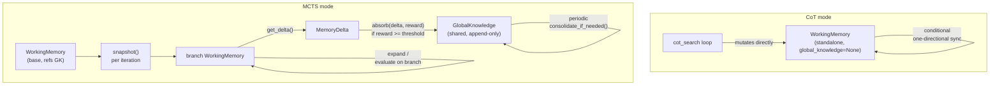

# Working Memory Redesign

This folder documents the redesigned working memory subsystem used by WEMG
reasoning strategies (CoT and MCTS).

## Design goals

1. **MCTS branch isolation** -- branches must not leak facts to each other
   through shared mutable state.
2. **No circular graph-text conversion** -- avoid lossy round-trips that
   destroy information.
3. **Cost reduction** -- synchronization should only run when enough new data
   has accumulated.
4. **Traceability** -- graph edges carry provenance so contradictions can be
   resolved by the answer generator in context.

## Overview diagram

## Documents

| File | Content |
|------|---------|
| [architecture.md](architecture.md) | Classes, snapshot/delta lifecycle, MCTS vs CoT wiring |
| [synchronization.md](synchronization.md) | Dirty tracking, thresholds, one-directional sync, async pipeline |
| [contradictions.md](contradictions.md) | Text vs graph contradiction strategy |
| [provenance.md](provenance.md) | Edge metadata fields and how they flow |

## Key source files

| Path | Role |
|------|------|
| `wemg/reasoning/working_memory.py` | `GlobalKnowledge`, `MemoryDelta`, `WorkingMemory` |
| `wemg/reasoning/memory.py` | Public re-exports |
| `wemg/reasoning/mcts.py` | Snapshot-based MCTS loop |
| `wemg/reasoning/cot.py` | Linear CoT (uses sync wrapper) |
| `wemg/reasoning/generator.py` | `NodeGenerator.update_working_memory()` with provenance |
| `wemg/system.py` | Creates `GlobalKnowledge` for MCTS, wires into `mcts_search` |
| `wemg/config.py` | `WorkingMemoryConfig` thresholds |
| `wemg/evaluation/runner.py` | Artifact serialization (merges global + local) |
