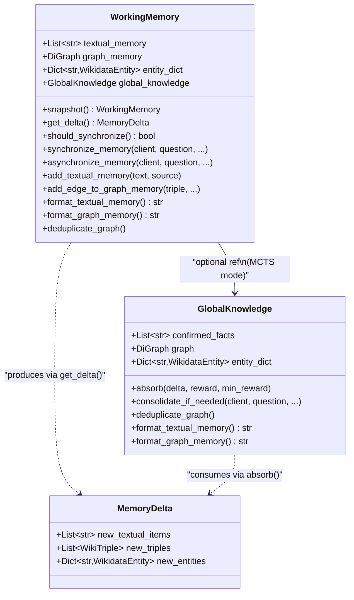
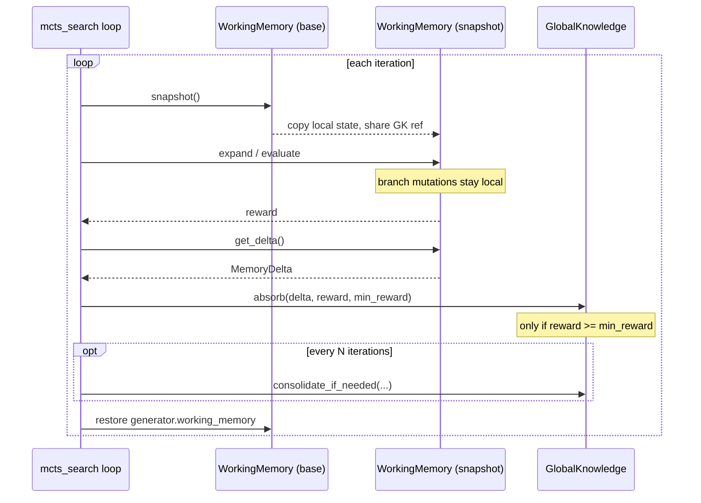
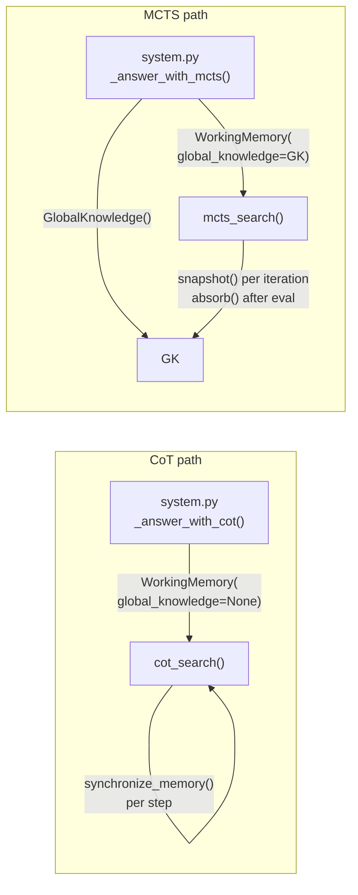

# Architecture

## Class diagram



## `WorkingMemory` (local / per-path)

Defined in `wemg/reasoning/working_memory.py`.

Holds the **local** reasoning state for one path or step:

| Attribute | Type | Purpose |
|-----------|------|---------|
| `textual_memory` | `List[str]` | Deduplicated text facts with provenance tags |
| `graph_memory` | `nx.DiGraph` | Extracted triples (nodes carry `Entity` data, edges carry `relation` sets and optional `provenance`) |
| `entity_dict` | `Dict[str, WikidataEntity]` | Wikidata entity cache |
| `global_knowledge` | `GlobalKnowledge or None` | Shared store reference (set for MCTS, `None` for CoT) |

When `global_knowledge` is set, the formatters merge both views:

- `format_textual_memory()` prepends `global_knowledge.confirmed_facts` before local items.
- `format_graph_memory()` composes `global_knowledge.graph` with `graph_memory` using `nx.compose`.

When `global_knowledge` is `None`, the instance is standalone (CoT, unit tests).

## `GlobalKnowledge` (shared across MCTS tree)

Also in `wemg/reasoning/working_memory.py`.

| Attribute | Type | Purpose |
|-----------|------|---------|
| `confirmed_facts` | `List[str]` | Text facts promoted from successful branches |
| `graph` | `nx.DiGraph` | Structured triples extracted from confirmed facts |
| `entity_dict` | `Dict[str, WikidataEntity]` | Entities discovered across all branches |

Updates arrive through two paths:

1. **`absorb(delta, reward, min_reward)`** -- reward-gated promotion of branch
   discoveries.  Only text facts and entities are absorbed directly; the graph
   is updated from those facts during the next consolidation.
2. **`consolidate_if_needed(client, question, ...)`** -- periodic maintenance:
   - LLM text consolidation when `confirmed_facts` count exceeds threshold
   - One-directional extraction of unprocessed text into the global graph
   - Structural QID-based graph dedup when node count exceeds threshold

## `MemoryDelta`

A lightweight dataclass (`@dataclass`) returned by `WorkingMemory.get_delta()`:

```python
@dataclass
class MemoryDelta:
    new_textual_items: List[str]
    new_triples: List[WikiTriple]
    new_entities: Dict[str, WikidataEntity]
```

## Snapshot / delta lifecycle



Key invariants:

- Mutations on a snapshot never propagate back to the base or to other snapshots.
- `global_knowledge` is shared by reference, so all snapshots read the same
  confirmed facts (but never write to it directly -- only `absorb` does).

## CoT vs MCTS wiring



- `wemg/system.py` creates `GlobalKnowledge` only for the `mcts` strategy.
- `wemg/config.py` exposes thresholds via `WorkingMemoryConfig`:
  `sync_text_threshold`, `sync_graph_node_threshold`, `absorption_min_reward`.
