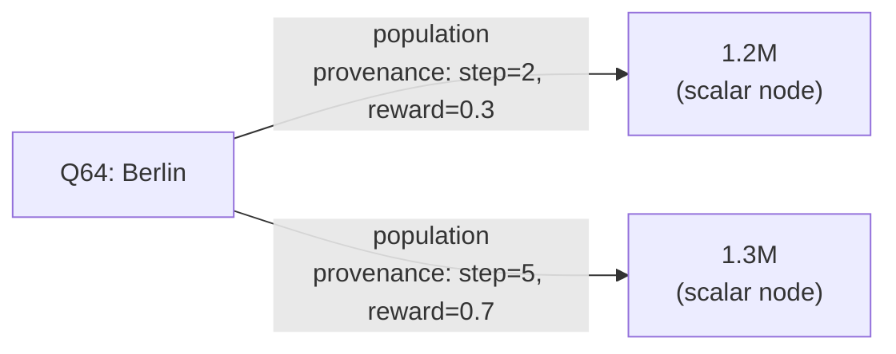
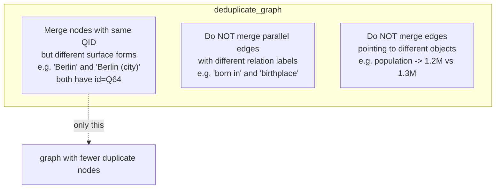

# Contradiction handling

Redundant or contradictory facts can enter working memory from different
retrieval sources or reasoning branches.  The two memory tiers handle them
independently.

## Text-level: LLM consolidation

`WorkingMemory.consolidate_textual_memory()` uses the LLM-based
`MEMORY_CONSOLIDATOR` role to merge, deduplicate, and resolve contradictions
in `textual_memory`.  It handles paraphrases ("Berlin is the capital of
Germany" vs "Germany's capital is Berlin") and contradictions ("population
1.2M" vs "population 1.3M") by picking the most supported version.

This is the same consolidator as before the redesign.  The only change is
that it now runs **conditionally** -- only when `_items_since_last_sync >=
sync_text_threshold`.

## Graph-level: preserve, do not overwrite

Contradictions in the graph are **kept as separate edges**. No LLM call is
made to resolve them at sync time.

Both edges naturally have different object nodes, so networkx stores them as
distinct edges.  Each carries a `provenance` dict with `source_step`,
`timestamp`, and/or `reward`.

### Why keep both?

- The answer generator already has full question context and can decide which
  value to trust.
- Removing one eagerly (at sync time) risks discarding the correct one before
  the generator even sees it.
- Provenance metadata provides recency and confidence signals the generator
  can use for future weighting improvements.

### What `deduplicate_graph()` does and does NOT do

- Merges: nodes sharing the same QID that entered via different surface
  forms.  Edges are re-wired to the canonical node.
- Preserves: parallel edges with different relation labels.
- Preserves: contradicting edges (same subject + relation, different object).

### Current rendering limitation

`wemg/utils/graph.py::textualize_graph()` renders node descriptions and
`relation` labels but does **not** include `provenance` in the formatted text
that the answer generator sees.  The provenance is available on the raw
`networkx` edge data for debugging or future extensions.
