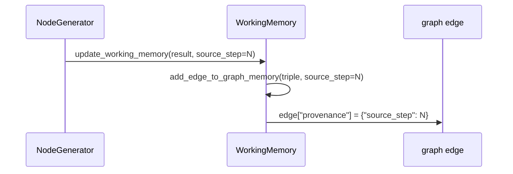
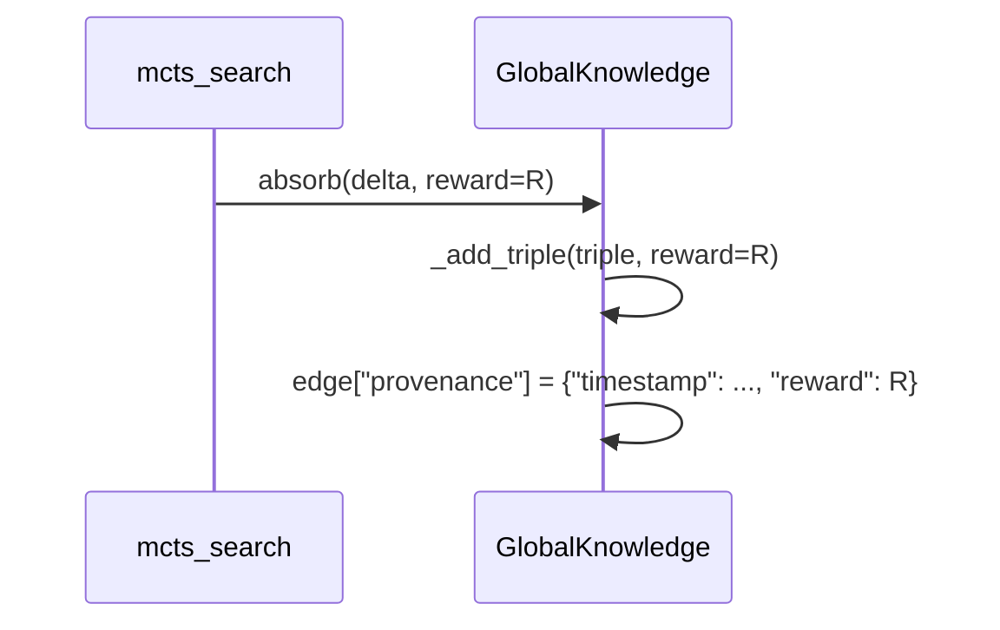

# Edge provenance

Graph edges can carry provenance metadata for debugging, auditing, and
future downstream weighting.

## Data model

Each edge in `graph_memory` (a `networkx.DiGraph`) stores attributes:

| Attribute | Type | Purpose |
|-----------|------|---------|
| `relation` | `set[str]` | One or more relation labels for this edge |
| `provenance` | `dict` (optional) | Metadata about when/how the edge was created |

The `provenance` dict may contain:

| Key | Type | Meaning |
|-----|------|---------|
| `source_step` | `int` | Reasoning step index that produced this edge |
| `timestamp` | `float` | Wall-clock time (`time.time()`) when recorded |
| `reward` | `float` | Branch evaluation reward (set during MCTS absorption) |

## How provenance flows



In MCTS, when a branch delta is absorbed into `GlobalKnowledge`:



## What is and is not rendered

The text rendering pipeline (`wemg/utils/graph.py::textualize_graph`) currently
outputs:

```
Subject: <node description>
Relation: <relation label>
Object: <node description>
```

It does **not** include `provenance` fields in the output.  The provenance is
available on the raw `networkx` edge for:

- Debugging and inspection (e.g. artifact `.pkl` files).
- Future extensions that surface provenance in the LLM prompt.
- Programmatic filtering or weighting of triples before answer generation.

## Example: inspecting provenance in a saved artifact

```python
import pickle
graph = pickle.load(open("working_memory_graph.pkl", "rb"))
for u, v, data in graph.edges(data=True):
    prov = data.get("provenance", {})
    print(f"{u} -> {v}  relations={data.get('relation')}  provenance={prov}")
```
