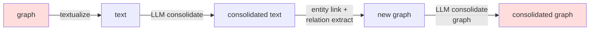
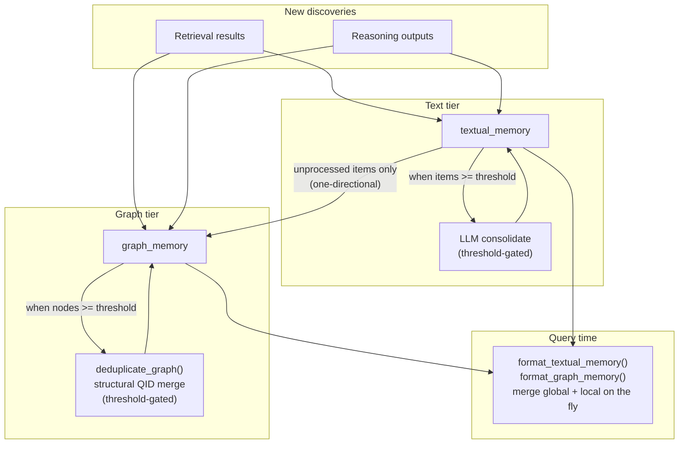
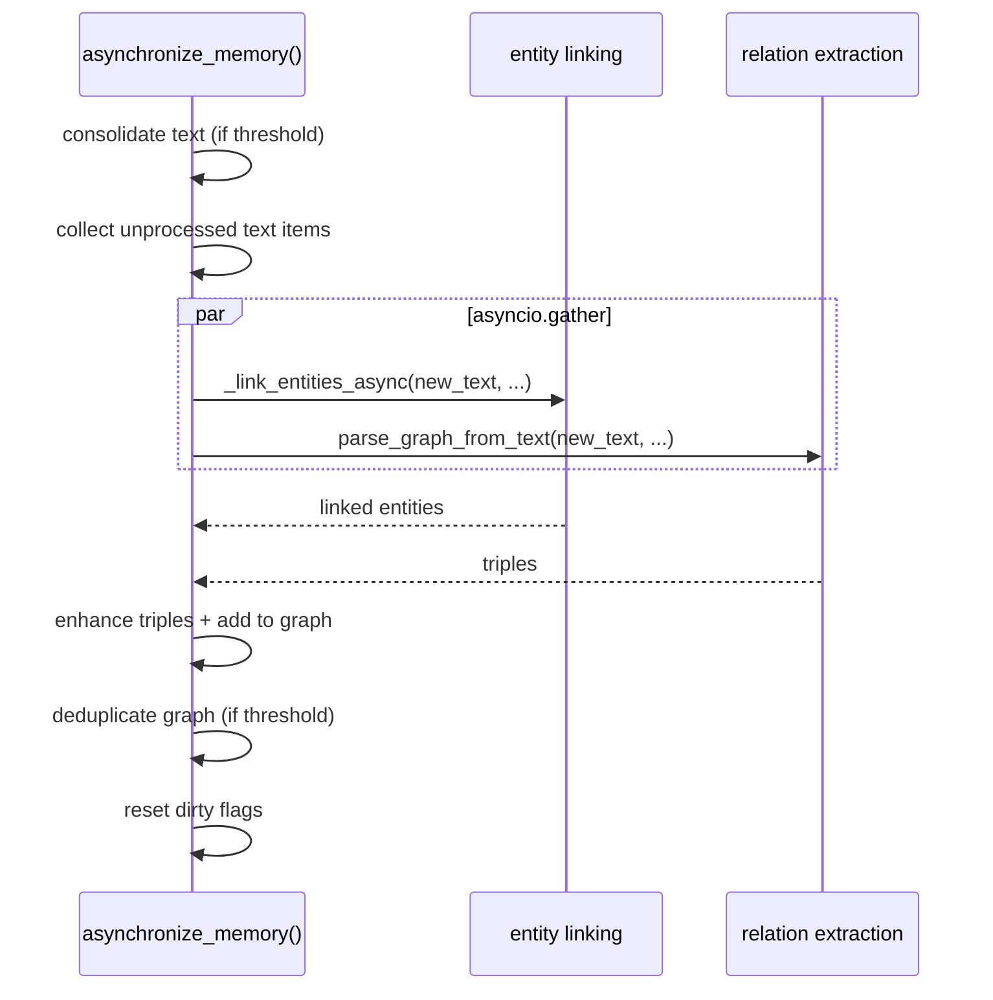

# Synchronization

WEMG maintains two related representations for each reasoning path:

- **Text** (`textual_memory`) -- flat list of tagged fact strings.
- **Graph** (`graph_memory`) -- `networkx.DiGraph` of entity-grounded triples.

The redesign keeps them consistent without expensive circular conversion.

## Old design (circular, removed)



Problems: 2 full lossy round-trips per sync, ~5 LLM calls, information loss.

## New design (one-directional)



Key rule: **graph never feeds back into text**.  Text is only extracted into the
graph once (tracked by `_text_item_ids_processed`).

## Conditional / incremental gating

Synchronization is skipped unless enough new data has accumulated.

| Tracking field | Set by | Checked by |
|---------------|--------|------------|
| `_dirty` | `add_textual_memory()` | `should_synchronize()` |
| `_items_since_last_sync` | `add_textual_memory()` | `should_synchronize()` and text consolidation gate |
| `_text_item_ids_processed` | `asynchronize_memory()` | unprocessed-items filter |

Decision logic in `should_synchronize()`:

```
dirty AND items_since_last_sync >= sync_text_threshold
```

Graph dedup triggers when:

```
graph_memory.number_of_nodes() > sync_graph_node_threshold
```

Both thresholds are configurable in `wemg/config.py` via `WorkingMemoryConfig`.

## Async pipeline

`asynchronize_memory()` is the async implementation.  It parallelises the two
most expensive I/O-bound steps on the same text batch:



The sync wrapper `synchronize_memory()` calls `asyncio.run(asynchronize_memory(...))`.

Internally, text consolidation uses `_aconsolidate_textual_memory()` (an async
version that awaits `_run_consolidation` directly) to avoid nesting
`asyncio.run()` inside a running event loop.
