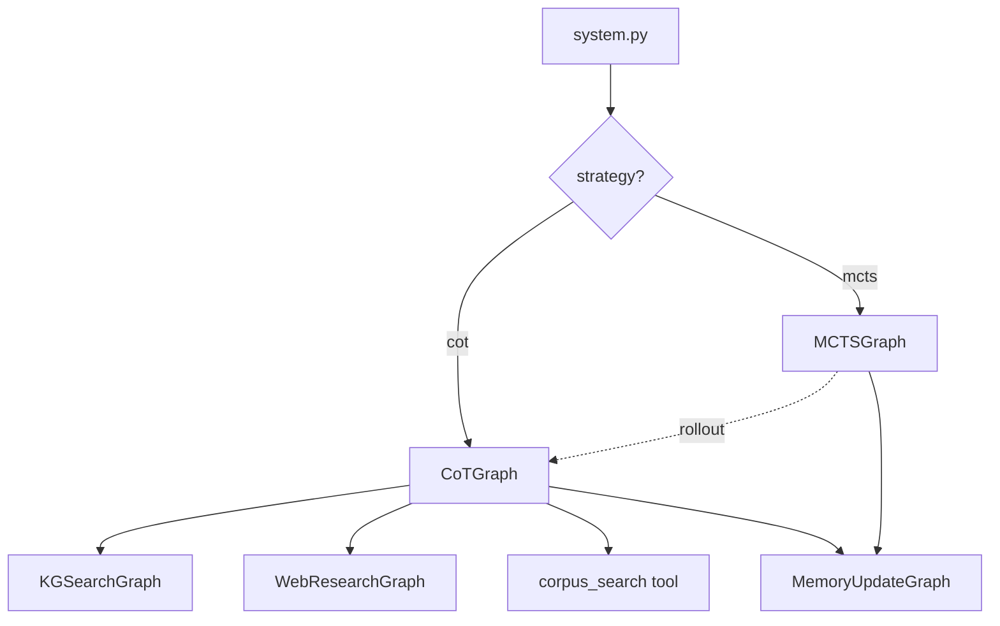
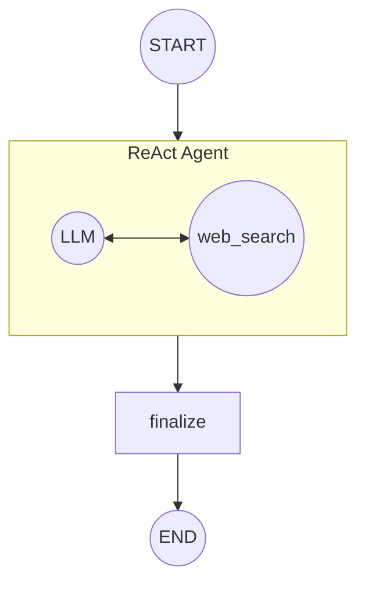
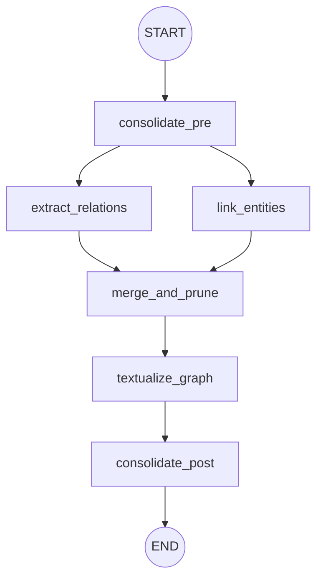
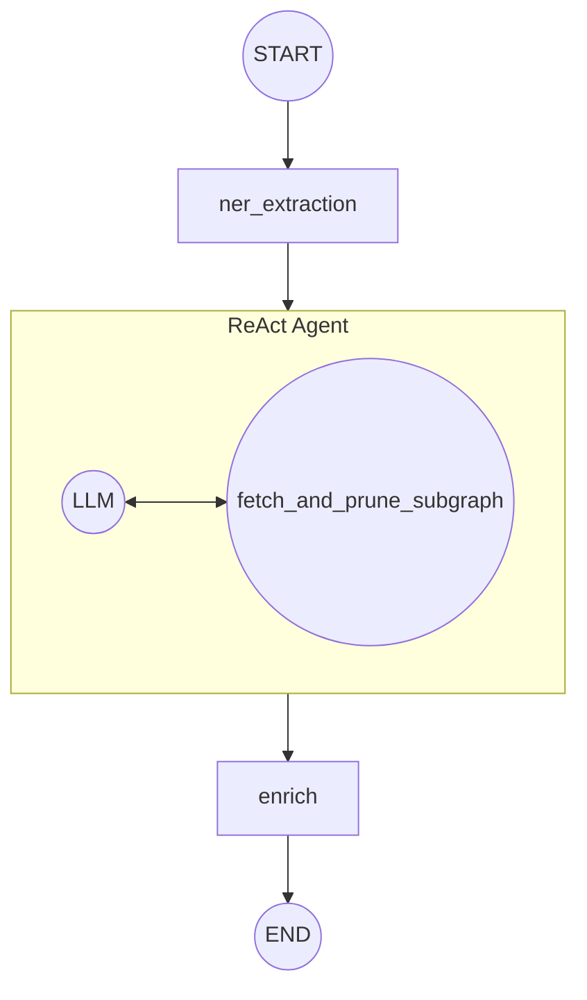
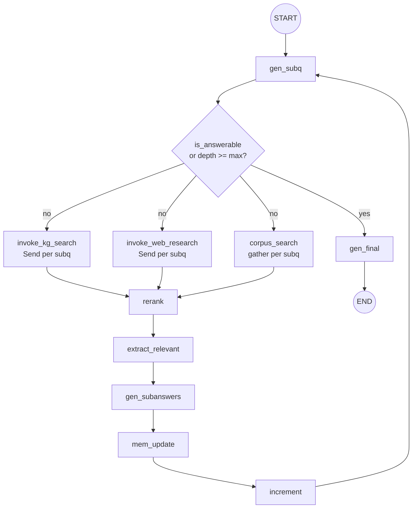
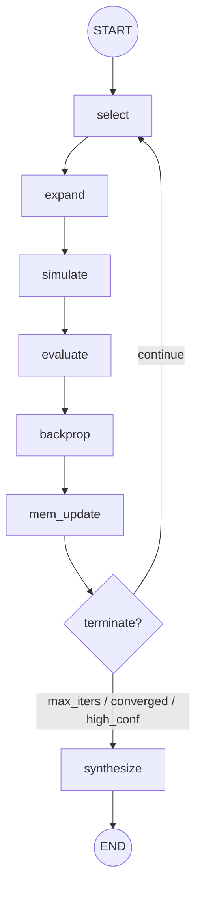

# LangGraph CoE Implementation Plan

> Port of the legacy `wemg/` pure-Python MCTS/CoT pipeline onto LangChain / LangGraph primitives.
> Locked design decisions also live in project memory at `project_langgraph_coe_port_design.md`.

## 1. Architectural Overview

Five hierarchical subgraphs, each compiled independently and reusable:

| Subgraph | Purpose | Reuse |
|---|---|---|
| `KGSearchGraph` | Multi-hop Wikidata retrieval | Tool for CoT + MCTS |
| `WebResearchGraph` | ReAct agent over web search | Tool for CoT + MCTS |
| `MemoryUpdateGraph` | Bidirectional text ↔ graph memory sync | Called by CoT + MCTS |
| `CoTGraph` | Linear sub-Q / sub-A reasoning loop | Standalone strategy + MCTS rollout |
| `MCTSGraph` | Tree search with CoT rollouts | Standalone strategy |

Top-level orchestration in `system.py` selects MCTS or CoT via `config.search.strategy`.



---

## 2. Phase Order & Scope

| Phase | Deliverable | Depends on |
|---|---|---|
| **0** | Prep: new roles, `kg_search.py` refactor, Redis cache, `WebResearchGraph` | — |
| **1** | `MemoryUpdateGraph` | Phase 0 |
| **2** | `CoTGraph` | Phases 0, 1 |
| **3** | `MCTSGraph` | Phase 2 |
| **4** | `system.py` orchestrator | Phases 0–3 |

Tests land under `langgraph_coe/tests/` per phase as **target specs** (tests describe the goal the implementation must reach, not current state).

**Out of scope this port phase:** LangGraph checkpointer (Sqlite/Postgres saver). Revisit after MCTS + CoT stabilize for long-run resume + observability.

---

## 3. Phase 0 — Prep Layer

### 3.1 New roles

Add to `langgraph_coe/roles.py`:

- **`web_researcher`** (light tier). Input: `subquery + research_budget`. Output: list of `{title, url, snippet, full_text}`. System prompt covers research goal, iterative-query strategy, stopping criteria, output schema. Used as the agent prompt inside `WebResearchGraph`.

Register tier mapping in `config.py::LLMConfig.role_tiers`. Roles trimmed from the port are listed in §3.6.

### 3.2 KGSearchGraph refactor

Existing `langgraph_coe/graphs/kg_search.py`:

- Replace `ner_agent_node` (currently `create_agent` bound to `link_entities` tool) with a plain async node calling `model.with_structured_output(NEROutput)` once. NER is always one-shot — the agent layer added recursion without benefit.
- After NER yields names, call the `link_entities` tool directly (no LLM mediation) for QID resolution.
- `triple_search_agent` stays as `create_react_agent` (iteration is genuinely valuable).
- `enrich` node unchanged.
- **Move `reset_wikidata_session()` out** — see §3.3.

### 3.3 ContextVar reset relocation

`reset_wikidata_session()` is currently called inside `ner_agent_node`. Under MCTS, `KGSearchGraph` is invoked many times per question (every CoT iteration × every rollout). Per-invocation reset would wipe the `_cv_visited_qids` set that the three-layer loop prevention depends on.

**Move to:** `system.py`, called exactly once per question before strategy-graph invocation.

### 3.4 Redis caching

Wikidata is the most expensive retrieval surface (2 RPS, network-bound) and most of what it returns is stable across questions — promote the cache from "wrap `get_triples`" to a **first-class persistent layer** covering every stable lookup path.

**Single Redis instance, separate DB indices:**

| DB | Purpose | Wired via |
|---|---|---|
| `0` | LLM response cache | `set_llm_cache(RedisCache(redis_=Redis(db=0)))` |
| `1` | Wikidata + web persistent cache | `WikidataClient(cache=RedisDictCache(db=1))` |

Both initialized in `system.py` after config load when `config.cache.enabled`.

**LLM cache (db=0):** LangChain `RedisCache` over `ChatLiteLLM` invocations.

**Wikidata cache (db=1):** four read-through layers wrapped inside `WikidataClient`. Pruning results are **not** cached (query-dependent, near-zero reuse).

| Layer | Key | Default TTL | Why |
|---|---|---|---|
| QID → entity metadata | `wd:entity:{qid}` | 30 days | Stable across years; popular entities recur across the dataset |
| Name → candidate QIDs | `wd:search:{name}` | 7 days | Hot path for entity linking; very high reuse |
| QID → 1-hop triples | `wd:triples:{qid}` | 7 days | High reuse for popular QIDs; medium payload |
| QID → Wikipedia article | `wd:enrich:{qid}` | 30 days | Largest payload; highest skip value |

Read-through pattern at the client level (not the tool boundary — every code path benefits):

```python
class WikidataClient:
    async def get_entity(self, qid: str) -> WikidataEntity:
        key = f"wd:entity:{qid}"
        if hit := await self._cache.get(key):
            return WikidataEntity.model_validate_json(hit)
        entity = await self._fetch_entity(qid)
        await self._cache.set(key, entity.model_dump_json(), ex=self._ttl_entity)
        return entity
```

All four lookup methods (`get_entity`, `search_entities`, `get_triples`, `get_wikipedia_content`) follow this shape.

**Web search cache (also db=1, prefix `web:`):** keyed by `(query, top_k)`, TTL 24h. Cuts agent-driven re-queries within `WebResearchGraph` to near-free.

**Invalidation policy:** none — long TTLs only. Research/eval workloads do not care about Wikidata freshness; if the underlying data meaningfully changes, flush the relevant DB manually. No code path performs invalidation.

**Config additions:**

```yaml
cache:
  enabled: true
  redis:
    host: localhost
    port: 6379
    llm_db: 0
    wikidata_db: 1
  wikidata:
    entity_ttl:  2592000   # 30d
    search_ttl:   604800   #  7d
    triples_ttl:  604800   #  7d
    enrich_ttl:  2592000   # 30d
  web:
    ttl:           86400   # 24h
```

### 3.5 WebResearchGraph

New subgraph at `langgraph_coe/graphs/web_research.py`.

**State:**

```python
from typing import TypedDict, List, Dict, Any, Annotated
from langgraph.graph.message import add_messages
from langchain_core.messages import BaseMessage

class WebResearchState(TypedDict):
    subquery: str
    original_query: str
    context: str

    messages: Annotated[List[BaseMessage], add_messages]

    queries_issued: int
    results: List[Dict[str, Any]]   # {title, url, snippet, full_text}
    errors: List[str]
```

**Graph:**



- **`web_research_agent`**: `create_react_agent(model=light_tier, tools=[web_search], prompt=web_researcher.system_prompt)`. Decisions are simple ("query enough? refine how?") — light tier suffices.
- **`finalize`**: Parses `ToolMessage` entries with `.name == "web_search"` from the agent trace, dedupes by URL, returns top-N → `results`.

**Three-layer loop prevention parity with `kg_search`:**

1. LangGraph `recursion_limit` on `agent.ainvoke(config=...)`.
2. In-state `queries_issued` counter against `config.web_search.max_queries_per_agent`.
3. ContextVar `_cv_visited_urls: ContextVar[Set[str]]` populated by the `web_search` tool to dedup within a question (parity with [project_langchain_ainvoke_context_isolation](../../../.claude/projects/-home-hieum-projects-wemg/memory/project_langchain_ainvoke_context_isolation.md)).

### 3.6 Role catalogue: kept, kept-for-future, dropped

The port preserves more of `wemg/llm/roles.py` than the active subgraphs need today. Roles split into three groups:

**Kept (active callers in Phase 1–3):** `subquestion_generator`, `answer_generator`, `web_researcher`, `self_corrector`, `final_answer_synthesizer`, `verifier`, `memory_consolidation`, `relation_extraction`, `triple_pruner`, `named_entity_recognition`, `extractor`, plus the two KG-agent system prompts.

**Kept without a current caller (planned use):**

| Role | Planned use |
|---|---|
| `question_rephraser` | Candidate MCTS expansion generator if `REPHRASED_QUESTION_NODE` is reintroduced after Phase 3. |
| `reasoning_synthesizer` | Candidate MCTS expansion generator if `SYNTHESIS_NODE` is reintroduced after Phase 3. |
| `evaluator` | Offline answer-evaluation harness against gold labels (separate from online QA `verifier`). |

These three are intentionally **not** wired into any subgraph in this port phase. Tier mappings stay populated in `config.py::LLMConfig.role_tiers` so adding a caller does not require touching config.

**Dropped:**

| Dropped role | Reason |
|---|---|
| `query_generator` | Subsumed by the updated `subquestion_generator` prompt (retrieval-ready phrasing, temporal grounding). See §7.3. |
| `majority_voter` | Replaced by `final_answer_synthesizer` over MCTS-scored candidates (§8.3 synthesize). |
| `consensus_evaluator` | Pairwise consensus check, never used by wemg MCTS. |

If a dropped role becomes necessary later, restore from git history rather than reintroducing a new variant — the prompts have been tuned and should not be rewritten.

---

## 4. MemoryUpdateGraph (Phase 1)

Decomposes legacy `synchronize_memory` (`wemg/reasoning/working_memory.py`) into a deterministic graph with parallel relation extraction and entity linking.

### 4.1 State

```python
from typing import TypedDict, List, Dict, Any
import networkx as nx

class MemoryUpdateState(TypedDict):
    # Inputs
    question: str
    new_text_items: List[str]
    new_raw_triples: List[Any]               # Structured triples from KG retrieval
    current_text_memory: List[str]
    current_graph: nx.DiGraph
    entity_dict: Dict[str, Any]              # QID -> WikidataEntity (wemg parity; avoids re-resolution)

    # Intermediates (populated concurrently)
    consolidated_memory: List[str]
    extracted_relations: List[Any]
    linked_entities: Dict[str, str]          # Name -> QID

    # Outputs
    updated_text_memory: List[str]
    updated_graph: nx.DiGraph
    updated_entity_dict: Dict[str, Any]
```

### 4.2 Node design



- **`consolidate_pre`**: `memory_consolidation` role on `current_text_memory + new_text_items`. Enforces `config.memory.max_textual_memory_tokens` (wemg default 16384). → `consolidated_memory`.
- **`extract_relations`**: `relation_extraction` role on `consolidated_memory`. Yields `(src, rel, tgt)` tuples → `extracted_relations`.
- **`link_entities`**: `named_entity_recognition` role on `consolidated_memory` → entity names; then `link_entities` tool resolves QIDs (skipping names already in `entity_dict`). Updates `linked_entities` and `updated_entity_dict`.
- **`merge_and_prune`**:
  - Ingests `extracted_relations` (from text) + `new_raw_triples` (from direct KG retrieval).
  - `triple_pruner` role on **newly proposed edges only**, batched at 16 (`wemg/reasoning/generator.py:31` parity).
  - Merges validated edges into an independent copy of `current_graph` → `updated_graph`.
  - Collapses duplicate nodes by QID (parity with `_GraphStore.merge_same_qid_nodes()`).
- **`textualize_graph`**: Serializes newly validated edges as `"Subject: X | Relation: Y | Object: Z"` strings; appends to `consolidated_memory`.
- **`consolidate_post`**: Second `memory_consolidation` pass to fold the textualized triples smoothly into prose memory. → `updated_text_memory`.

---

## 5. KGSearchGraph

Already exists at `langgraph_coe/graphs/kg_search.py`. Phase 0 refactor delta in §3.2. Post-refactor shape:

```python
from typing import TypedDict, List, Dict, Annotated
from langgraph.graph.message import add_messages
from langchain_core.messages import BaseMessage

class KGSearchState(TypedDict):
    subquery: str
    original_query: str
    context: str

    messages: Annotated[List[BaseMessage], add_messages]

    qids_for_triples: List[str]
    linked_entities: List[Dict[str, str]]
    triples: List[str]
    kg_articles: List[str]
    enriched_entity_labels: List[str]
    errors: List[str]
```



- **`ner_extraction`** (refactored): `model.with_structured_output(NEROutput)` over `subquery + context` → entity names. Then call `link_entities` tool directly to resolve QIDs → `linked_entities`, `qids_for_triples`.
- **`triple_search_agent`** (unchanged): `create_react_agent` with `create_fetch_and_prune_tool(registry)` (Stage A reranker + Stage B `triple_pruner` LLM pruning).
- **`enrich`** (unchanged): `enrich_entities` tool batch → `kg_articles`, `enriched_entity_labels`.

---

## 6. WebResearchGraph

See §3.5.

---

## 7. CoTGraph (Phase 2)

Replaces legacy `cot_search` while-loop (`wemg/reasoning/cot.py`) with explicit nodes and native fan-out.

### 7.1 Reducer pattern (`Clear` marker)

```python
from dataclasses import dataclass
from typing import List, TypeVar, Union

T = TypeVar("T")

@dataclass
class Clear:
    """Sentinel signaling the reducer to reset the accumulator."""

def append_or_clear(left: Union[List[T], None], right: Union[List[T], Clear]) -> List[T]:
    if isinstance(right, Clear):
        return []
    return (left or []) + right
```

Replaces the previous draft's string `"CLEAR"` sentinel (type-mixed reducer signature was brittle; risked accidental string-as-element insertion).

### 7.2 State

```python
from typing import TypedDict, List, Annotated, Any, Dict
import networkx as nx

import operator

class CoTState(TypedDict):
    # Inputs & config
    question: str
    max_depth: int

    # Loop control
    depth: int
    is_answerable: bool

    # Per-iteration handoff (cleared at iteration end via Clear())
    subquestions: List[str]
    retrieved_raw_context: Annotated[List[str], append_or_clear]
    retrieved_raw_triples: Annotated[List[Any], append_or_clear]
    reranked_context: List[str]
    current_subanswers: List[str]

    # Append-only trajectory record. Each entry captures one CoT iteration's
    # decomposition + answers. Used by MCTSGraph.simulate to adapt rollout
    # steps into tree nodes; harmless when CoTGraph runs standalone.
    iteration_history: Annotated[List[Dict[str, Any]], operator.add]

    # Cross-iteration memory (mutated by MemoryUpdateGraph)
    text_memory: List[str]
    graph_memory: nx.DiGraph
    entity_dict: Dict[str, Any]

    # Output
    final_answer: str
```

### 7.3 Node design



- **`gen_subq`**: `subquestion_generator` role over `text_memory + textualize(graph_memory)`. Sets `is_answerable` and `subquestions`.
- **`route`** (conditional edge): `is_answerable` or `depth >= max_depth` → `gen_final`; else fan out three ways.
- **Three-way fan-out (symmetric per subquestion):**

  | Branch | Mode | Why |
  |---|---|---|
  | KG | `Send` per subquestion → `KGSearchGraph` | Per-entity-set precision |
  | Web | `Send` per subquestion → `WebResearchGraph` | Open-world; agent reformulates queries |
  | Corpus | `asyncio.gather` of `corpus_search` per subquestion (one FAISS+reranker round-trip each) | Joined-query embedding collapses to a centroid that under-recalls each subquestion's tail; the reranker can only rescore what the embedder already surfaced. |

  All three append into `retrieved_raw_context` via `append_or_clear`. KG also appends structured triples into `retrieved_raw_triples`.

  **No LLM call inside `corpus_join`.** The `subquestion_generator` prompt already enforces retrieval-ready phrasing, rank verification, and temporal grounding; the `query_generator` role wemg used here has been dropped from the port (see §3.6). If alias fallbacks turn out to matter empirically, prefer a cheap heuristic expansion (subquestion + top entity labels from `entity_dict`) before re-introducing an LLM step.

- **`rerank`**: Waits for all fan-outs (LangGraph synchronization barrier). Scores joined `retrieved_raw_context` against `subquestions` via reranker endpoint. Trims to top-k → `reranked_context`.

- **`extract_relevant`**: `EXTRACTOR` role (light tier) over the reranked top-k. Distills raw passages into atomic, self-contained facts — resolves anaphora, removes document-internal references ("the company", "as noted above"), and emits one claim per item. The reranker already handled relevance filtering; this step's value is **self-containment + atomicity** for downstream subanswer grounding and memory consolidation.

  **Char-budgeted batching.** Joined `reranked_context` can exceed the model's context window (a single web `full_text` is often 10–20k tokens). The node splits passages into `cfg.memory.extractor_max_input_chars`-sized batches (default 24k chars ≈ 7k tokens), runs one EXTRACTOR call per batch in parallel via `asyncio.gather`, and merges + dedupes the resulting facts (case-insensitive, order-preserving). An oversized single passage goes into its own batch untouched — truncation would silently drop evidence.

  **Relevance lens.** The extractor's `question` field is built from `state["question"]` plus the current `subquestions`, so the relevance evaluation covers both the global intent and the iteration's specific gaps.

  **Fallback.** If EXTRACTOR returns no facts (e.g. structured-output parse failure), the node falls back to the raw `reranked_context` so `gen_subanswers` still has evidence to ground on. Silent evidence loss is unacceptable.

  **Cost.** +1 light-tier LLM call per CoT iteration in the common case (one batch); +N when reranked top-k overflows the char budget. Cheaper than wemg's per-document extraction (which scaled as `subqs × branches × docs`) at the cost of slightly coarser per-document relevance — the reranker compensates.

- **`gen_subanswers`**: `answer_generator` role per `(subquestion, extracted_facts)`, parallel via `asyncio.gather`. The `context` field receives the joined output of `extract_relevant` (or the raw rerank passages if extraction yielded nothing). Populates `current_subanswers`.
- **`mem_update`**: Invokes compiled `MemoryUpdateGraph` with `current_subanswers` → `new_text_items` and `retrieved_raw_triples` → `new_raw_triples`. Merges results back into `text_memory`, `graph_memory`, `entity_dict`.
- **`increment`**: Appends the current iteration's record to `iteration_history` **before** clearing scratch, then bumps depth:
  ```python
  return {
      "iteration_history": [{
          "depth": state["depth"],
          "subquestions": state["subquestions"],
          "subanswers":   state["current_subanswers"],
      }],
      "depth": state["depth"] + 1,
      "subquestions": [], "reranked_context": [], "current_subanswers": [],
      "retrieved_raw_context": Clear(), "retrieved_raw_triples": Clear(),
  }
  ```
  The single-element list at `iteration_history` is appended by the `operator.add` reducer.
- **`gen_final`**: `final_answer_synthesizer` role against compiled memory → `final_answer`.

---

## 8. MCTSGraph (Phase 3)

Stores the search tree as a dict in state. Integrates compiled `CoTGraph` as the rollout subgraph with **shared memory** semantics (wemg parity — rollouts mutate parent's `text_memory` / `graph_memory` / `entity_dict` directly).

### 8.1 Node types and priors

True wemg parity — only the node types wemg's MCTS strategy map ([wemg/reasoning/mcts.py:64-66](../wemg/reasoning/mcts.py#L64)) actually generates. `SUB_QA_BATCH_NODE` is CoT-only; `REPHRASED_QUESTION_NODE` and `SYNTHESIS_NODE` exist in wemg's enum but have no MCTS generator — port omits them.

```python
from enum import Enum

class MCTSNodeType(str, Enum):
    USER_QUESTION  = "user_question"     # root only
    SUB_QA         = "sub_qa"
    SELF_CORRECTED = "self_corrected"
    FINAL_ANSWER   = "final_answer"      # terminal

NODE_TYPE_PRIOR: dict[MCTSNodeType, float] = {
    MCTSNodeType.SUB_QA:         0.60,
    MCTSNodeType.SELF_CORRECTED: 0.50,
    MCTSNodeType.FINAL_ANSWER:   0.30,
}
```

Values port from legacy `_NODE_TYPE_PRIOR` ([wemg/reasoning/mcts.py:27-34](../wemg/reasoning/mcts.py#L27)); tune during Phase 3.

### 8.2 State

```python
from typing import TypedDict, List, Dict, Any, Optional, Annotated
import networkx as nx

class MCTSTreeNode(TypedDict):
    node_id: str
    parent_id: Optional[str]
    children_ids: List[str]
    node_type: MCTSNodeType
    content: Dict[str, Any]
    visits: int
    value: float
    prior: float

def dict_merge(left: Dict[str, MCTSTreeNode],
               right: Dict[str, MCTSTreeNode]) -> Dict[str, MCTSTreeNode]:
    """Rightward dict union; right wins on key collisions (covers visits/value updates from backprop)."""
    return {**(left or {}), **right}

class MCTSState(TypedDict):
    # Inputs
    question: str
    max_iterations: int
    iteration: int

    # Tree
    tree: Annotated[Dict[str, MCTSTreeNode], dict_merge]
    root_id: str

    # Per-iteration traversal
    current_path: List[str]
    expanded_node_ids: List[str]
    simulation_result: Dict[str, Any]
    reward: float

    # Per-iteration retrieval accumulator (cleared each iteration)
    new_raw_triples: Annotated[List[Any], append_or_clear]

    # Cross-iteration shared memory (rollouts mutate in place)
    text_memory: List[str]
    graph_memory: nx.DiGraph
    entity_dict: Dict[str, Any]

    # Early termination tracking
    semantic_sufficiency_signals: int
    iterations_without_improvement: int
    best_value: float

    # Output
    final_answer: str
```

### 8.3 Node design



- **`select`**: Traverses `tree` from `root_id` using pUCT — `Q(s,a) + c·P(s,a)·√N(parent)/(1 + N(child))`, port of `wemg/reasoning/nodes.py:243-265`. Stops at unvisited leaf. Updates `current_path`.

- **`expand`**: Dispatches by leaf's `node_type` into parallel generators via `Send`. Strategy map mirrors [wemg/reasoning/mcts.py:64-66](../wemg/reasoning/mcts.py#L64):

  | Parent type | Generators run in parallel | Children emitted |
  |---|---|---|
  | `USER_QUESTION` | `gen_subqa`, `gen_final_answer` | one `SUB_QA` per subquestion + one `FINAL_ANSWER` |
  | `SUB_QA` | `gen_subqa`, `gen_self_correct` | one `SUB_QA` per next subquestion + one `SELF_CORRECTED` |
  | `SELF_CORRECTED` | `gen_subqa` | one `SUB_QA` per next subquestion |

  Generator → role mapping:

  | Generator | Roles invoked |
  |---|---|
  | `gen_subqa` | `subquestion_generator` (decompose) then `answer_generator` (one per subq, parallel) |
  | `gen_self_correct` | `self_corrector` |
  | `gen_final_answer` | `final_answer_synthesizer` |

  Child priors from `NODE_TYPE_PRIOR`. New tree nodes injected via `dict_merge`; extracted triples buffered into `new_raw_triples`. `FINAL_ANSWER` nodes are terminal and not expanded further.

  **No retrieval in `expand`.** The generators above run over shared memory only — `subquestion_generator` sees `text_memory + textualize(graph_memory)`; `answer_generator` here is invoked without an external retrieval pass and grounds on memory alone. Raw passages never enter this path, so no `EXTRACTOR` step is needed at the MCTS expansion level. All retrieval and its extractor distillation happen inside `simulate`'s `CoTGraph` rollout.

- **`simulate`**: Invokes the compiled `CoTGraph` with **shared references** to `text_memory` / `graph_memory` / `entity_dict` (parent-state mutation is intentional) and `max_depth = config.search.mcts.max_simulation_depth`. The rollout inherits CoTGraph's `extract_relevant` step (§7.3) end-to-end — every reranked passage produced inside a rollout iteration is distilled into atomic, self-contained facts before reaching `gen_subanswers` and, downstream, the MCTS shared memory. MCTS does not run its own extractor on top. After CoTGraph returns, walks `final_state["iteration_history"]` and adapts each entry into a single `SUB_QA` tree node via concatenation:

  ```python
  def cot_iteration_to_mcts_node(entry, parent_id) -> MCTSTreeNode:
      concat_q = "\n".join(f"Sub Q{i+1}: {q}" for i, q in enumerate(entry["subquestions"]))
      concat_a = "\n".join(f"Sub A{i+1}: {a}" for i, a in enumerate(entry["subanswers"]))
      return MCTSTreeNode(
          node_id=new_id(),
          parent_id=parent_id,
          children_ids=[],
          node_type=MCTSNodeType.SUB_QA,
          content={"sub_question": concat_q, "sub_answer": concat_a},
          visits=0, value=0.0,
          prior=NODE_TYPE_PRIOR[MCTSNodeType.SUB_QA],
      )
  ```

  Nodes are attached as a linear chain from `expanded_node_id`. If CoT terminated with a final answer, append one `FINAL_ANSWER` node at the tail (carrying `final_state["final_answer"]`). The terminal node's `node_id` becomes the path target for `evaluate`.

  **Cost note:** Each rollout step now invokes the full CoTGraph iteration (retrieval fan-out + rerank + `extract_relevant` + memory_update), which is heavier than wemg's `_generate_subqa_nodes`-only rollout. Recommended default `max_simulation_depth = 3` (down from wemg's 5) to keep total per-evaluate cost in a similar envelope. The extractor adds one light-tier LLM call per rollout iteration in the common case (more only when the reranked top-k overflows `cfg.memory.extractor_max_input_chars`). The upside: each rollout step is a real reasoning trajectory grounded on atomic facts, not a random-child walk — stronger evidence for the verifier reward.

  **Note on the BATCH-to-SUB_QA concat:** wemg's MCTS expand never produces `SUB_QA_BATCH_NODE`, so importing CoT-shaped batches as-is would create an asymmetry between expand-produced and rollout-imported tree nodes. The concat adapter resolves this — `SUB_QA`'s validator only requires `sub_question` and `sub_answer` to be strings; multi-Q concatenations pass cleanly. Trajectory rendering preserves per-pair structure via the `Sub Q{i}` / `Sub A{i}` numbering.

- **`evaluate`**: Three parallel `verifier` calls (wemg parity, `wemg/reasoning/mcts.py:189-243`):

  1. **No-context view** — verifier with question + answer only.
  2. **Text-memory view** — verifier with formatted `text_memory`.
  3. **Graph-memory view** — verifier with textualized `graph_memory`.

  Mean of 1–10 ratings → `reward = (mean - 5.0) / 5.0` ∈ [-1, 1]. Falls back to `0.0` on parse failure.

- **`backprop`**: For each `node_id` in `current_path`: `visits += 1`, `value += reward`. Emitted as a partial `tree` dict via `dict_merge`.

- **`mem_update`**: Invokes `MemoryUpdateGraph` with three payload sources merged:
  1. Text + triples from all `expanded_node_ids`.
  2. Text + triples from rollout steps.
  3. The three VERIFIER critique texts (one per view).

  `new_raw_triples` flows into `MemoryUpdateState.new_raw_triples`. Updated memory replaces `text_memory` / `graph_memory` / `entity_dict`.

  **No extractor pass here either.** All three input sources are model-generated text (subanswers from `gen_subqa` / rollout subanswers, verifier critiques) — already atomic and self-contained by construction. The rollout text was distilled by CoTGraph's `extract_relevant` before becoming a subanswer, so passing it through another EXTRACTOR call would be redundant. Memory consolidation inside `MemoryUpdateGraph` (Phase 1) is sufficient at this boundary.

- **`route`** (conditional edge): Port wemg's early-termination knobs from `wemg/reasoning/mcts.py:352-361`:

  | Condition | Action |
  |---|---|
  | `iteration >= max_iterations` | → `synthesize` |
  | `best_value >= config.search.mcts.high_confidence_threshold` | → `synthesize` |
  | `semantic_sufficiency_signals >= config.search.mcts.semantic_sufficiency_count` | → `synthesize` |
  | `iterations_without_improvement >= config.search.mcts.convergence_patience` | → `synthesize` |
  | else | → `select` |

- **`synthesize`**: Selects highest cumulative-value path from `root_id` and invokes `final_answer_synthesizer`. Emits `final_answer`.

---

## 9. Top-level orchestration (Phase 4)

`langgraph_coe/system.py`:

```python
async def answer(question: str, config: LangGraphCoeConfig) -> AnswerResult:
    # 1. Tool init (idempotent module-level)
    init_wikidata(config.wikidata)
    init_retrieval_pipeline(config.retriever, config.reranker)
    init_web_search(config.web_search)

    # 2. Role registry + Redis cache
    registry = RoleModelRegistry(config.llm)
    if config.cache.enabled:
        set_llm_cache(RedisCache(...))

    # 3. Per-question ContextVar reset (visited QIDs, visited URLs, hop count)
    reset_wikidata_session()
    reset_web_research_session()

    # 4. Compile + invoke strategy graph
    if config.search.strategy == "mcts":
        graph = build_mcts_graph(registry)
    else:
        graph = build_cot_graph(registry)

    result = await graph.ainvoke(initial_state_for(question, config))
    return AnswerResult.from_state(result)
```

Strategy switch (`mcts` vs `cot`) preserves wemg's `config.search.strategy` knob. Batch entry preserved via `answer_batch()` (ThreadPoolExecutor over independent `answer()` calls).

---

## 10. Out of scope (this port phase)

- **LangGraph checkpointer** (Sqlite / Postgres saver). Defer until MCTS + CoT stabilize.
- **Unified research agent** binding both `web_search` and `corpus_search` to one ReAct agent. Solve the symmetric web-agent first; unify later if cost / quality data warrants.
- **Trajectory recording** for offline RL fine-tuning.
